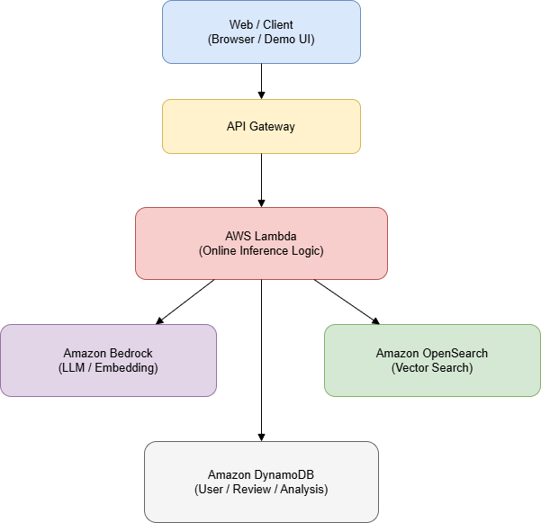

# 프로젝트 착수 보고서

---

## 프로젝트 명

볼래! 말래? - 정서·서사 기반 영화 취향 시뮬레이션 & 감성 검색 서비스

## 팀 명

납득이

# Ⅰ. 프로젝트 개요

## 1.1 프로젝트 배경

기존 영화 추천 서비스는 장르, 평점, 시청 이력 중심의 협업 필터링에 치우쳐 있어, 사용자가 실제 감상에서 중요하게 여기는 정서적 톤(우울/따뜻/긴장), 서사 선호(성장/관계/철학), 여운/결말 취향 같은 정성적 요인을 충분히 반영하지 못한다.

그 결과 사용자는 "이 영화가 나한테 맞을까?"에 대해 단순 추천 목록을 받지만, 왜 맞는지 또는 왜 안 맞는지에 대한 근거가 부족하여 추천을 신뢰하기 어렵다.

본 프로젝트는 LLM을 추천 생성기가 아니라 취향 해석기와 설명 생성기로 활용하고, 영화 텍스트를 정서·서사 관점으로 벡터화하여 벡터 검색과 결합함으로써, 단일 영화에 대한 만족 가능성 확률을 제시하는 취향 시뮬레이션 시스템을 구현한다.

## 1.2 프로젝트 목표 및 주요 목적

1. 사용자의 자유로운 텍스트 입력(리뷰/소감/질의)을 정서·서사 기반 취향 벡터로 구조화
2. 영화 줄거리와 메타데이터를 정서·서사 벡터로 변환하여 벡터 데이터베이스에 구축
3. 사용자와 영화 간 적합도를 만족 확률(0~1)로 예측
4. 예측 결과를 설명 가능한 자연어로 제공하여 신뢰도 향상
5. 자연어 감성 검색(잔잔한데 생각 정리되는 영화)을 구현
6. ML 기반 영화 군집화를 통한 취향 지도 시각화로 탐색 경험 제공
7. (확장) 그룹 취향 합성으로 관계 단위 만족 확률 제공

## 1.3 해결하고자 하는 문제 정의

- 기존 추천은 정서와 서사 선호를 직접 반영하기 어려움
- 추천의 설명 가능성이 부족하여 사용자가 결과를 신뢰하기 어려움
- “느낌 기반 검색”을 하면 키워드 일치 위주로 노출되어 의미 중심 검색이 어려움
- 함께 볼 콘텐츠 선택에서 그룹 단위 의사결정 지원이 부족
- "내가 뭘 좋아하는지 모르겠을 때" 탐색할 수 있는 시각적 도구가 부족

## 1.4 기대 효과

- 사용자 취향을 정서·서사 관점에서 구조화하여 개인화 품질 향상
- 확률과 설명을 함께 제공하여 추천 결과의 납득 가능성과 신뢰도 상승
- 자연어 감성 검색으로 키워드 기반 검색 대비 발견성 향상
- 취향 지도를 통해 사용자가 자신의 취향 영역을 시각적으로 이해하고 새로운 영화를 탐색
- 그룹 취향 시뮬레이터로 "다 같이 볼 영화" 의사결정 비용 감소

---

# Ⅱ. 프로젝트 범위 및 주요 업무

## 2.1 프로젝트 범위

### 2.1.1 포함(범위 내)

- 공개 데이터 기반 영화 메타데이터 및 줄거리 수집과 정제
- 영화의 정서·서사 요약 및 임베딩, 벡터 데이터베이스 구축
- 사용자 텍스트 기반 취향 벡터 생성(LLM 프롬프트 + JSON)
- 단일 영화 만족 확률 산출(가중 유사도 또는 경량 모델)
- 예측 설명 생성(LLM)
- 자연어 감성 검색 + 후보 생성 후 확률 산출
- ML 기반 영화 군집화 및 차원 축소를 통한 취향 지도 시각화
- (확장) 그룹 취향 합성 및 그룹 만족 확률

### 2.1.2 제외(범위 외)

- 대규모 상용 수준의 장기간 시청 기록 수집 및 학습
- LLM 파인튜닝 또는 대형 추천 모델 학습
- 다국어 및 국가별 콘텐츠 카탈로그 확장
- 저작권 이슈가 있는 원문 대량 스크래핑

## 2.2 주요 업무 또는 기능

아래 기능은 A-1부터 A-7까지 취향 시뮬레이션 파이프라인으로 연결된다.

### 2.2.1 A-1 정서 기반 취향 모델링(LLM)

- **입력**: 리뷰, 한줄 소감, 대화형 응답, 검색 질의
- **처리**: LLM 분석을 통해 정서 톤, 서사 선호, 결말 선호 등 추출
- **출력**: 사용자 취향 벡터(JSON)
- **API**: `/analyze/preference`

### 2.2.2 A-2 영화 특성 벡터링(LLM + Embedding)

- **입력**: 영화 메타데이터, 줄거리, 요약 리뷰
- **처리**: LLM이 영화의 정서·서사 특성을 요약하고 임베딩 생성
- **출력**: 영화 벡터 + 메타데이터 ID
- **저장**: 벡터 DB(OpenSearch Vector), 원천 및 가공 데이터(S3)

### 2.2.3 A-5 자연어 기반 감성 검색(LLM + RAG)

- **입력**: "우울한데 너무 무겁지 않은 영화" 같은 질의
- **처리**: 질의 임베딩 후 벡터 DB에서 상위 K개 후보 검색
- **출력**: 후보 영화 리스트(상위 K개)
- **API**: `/search/emotional`

### 2.2.4 A-3 취향 시뮬레이터(Prediction Core)

- **입력**: 사용자 취향 벡터 + 영화 특성 벡터
- **처리**: 차원별 유사도(정서/서사/결말)를 가중 합산하여 확률화
- **출력**: 만족 확률, 신뢰도
- **API**: `/predict/satisfaction`

### 2.2.5 A-4 설명 가능한 취향 추천(LLM)

- **입력**: 예측값 + 주요 기여 요소(상위 2~3개)
- **처리**: LLM이 자연어 설명 생성
- **출력**: 근거 2~3줄 + 주의사항(주관적/확률적) 안내
- **API**: `/explain/prediction`

### 2.2.6 A-6 그룹 취향 시뮬레이터(확장)

- **입력**: 그룹 구성원별 취향 벡터 N개
- **처리**: 공통 선호와 갈등 요인을 분리하고 합성 취향 벡터 생성
- **출력**: 그룹 만족 확률 + 개인별 적합도 코멘트
- **API**: `/group/simulate`

### 2.2.7 A-7 영화 취향 지도 (Taste Map) - ML 기반 시각화

- **입력**: 사용자의 취향과 영화 데이터베이스 기반 임베딩 벡터 집합
- **처리**: 고차원 임베딩 벡터를 2차원 좌표로 압축 및 의미가 비슷한 영화끼리 군집화(ex.씁쓸한 로맨스, 슬픈 코미디)하여 시각적으로 표현
- **출력**: 사용자 위치가 표시된 2차원 영화 취향 지도(WordCloud, Scatter)
- **API**: `/map/taste`

### 2.2.8 A-8 사용자 기반 워드클라우드

---

# Ⅲ. 목표 및 성과 지표

## 3.1 프로젝트 성공 기준

- 취향 벡터가 정해진 스키마(JSON)로 95% 이상 안정적으로 생성
- 감성 검색이 벡터 DB 기반 상위 K개 후보를 반환하며, 이후 예측 및 설명까지 연결
- 만족 확률이 재현 가능한 로직과 가중치로 산출되고, 동일 입력에 대해 일관된 결과 제공
- 설명이 확률 및 핵심 요인을 포함하여 사용자가 납득할 수 있는 형태로 출력
- 영화 취향 지도가 10~15개 의미 있는 군집으로 시각화되며, 각 군집에 자동 생성된 태그명이 부여됨
- 배치 처리(영화 벡터 구축, 취향 지도 생성)와 온라인 처리(사용자 요청) 경로가 분리되어 운영 가능

## 3.2 성과 측정 주요 지표

| 지표 | 정의(측정 방법) | 목표 |
| --- | --- | --- |
| 취향 벡터 생성 성공률 | A-1 응답이 스키마 검증을 통과한 비율 | ≥ 95% |
| 검색→예측 연결 성공률 | A-5→A-3→A-4까지 1회 호출로 결과 반환 비율 | ≥ 90% |
| p95 응답 시간(예측+설명) | API Gateway 기준 p95 지연시간 | ≤ 5초 |
| 취향 지도 생성 성공률 | 배치 작업 완료 및 좌표 데이터 정상 저장 비율 | ≥ 95% |
| 군집 태그 품질 | 각 군집 태그가 인간이 이해 가능한 형태인지 내부 평가 | ≥ 80% |
| 후보 적합도 정합성 | 상위 5개 후보에 대한 "설명 일관성" 체크리스트 통과율 | ≥ 80% |
| 시스템 오류율 | 5xx 에러 비율(CloudWatch) | ≤ 5% |

---

# Ⅳ. 일정 계획

## 4.1 주요 일정

전체 기간: 2026년 1월 22일 ~ 2026년 3월 2일 (약 6주)

이 중 핵심 MVP는 4주 내 구현을 목표로 하고, 나머지 기간은 품질 개선, 문서화, 발표 준비에 사용

| 주차 | 주요 활동 |
| --- | --- |
| 1주차 | 요구사항 확정, 데이터 수집 파이프라인 구축, AWS 인프라 초기 설정 |
| 2주차 | LLM 프롬프트 설계 및 테스트, 영화 벡터화 배치 작업 시작 |
| 3주차 | 취향 분석 API(A-1) 개발, 벡터 DB 구축 및 검색 기능(A-5) 구현, ML 군집화 및 차원 축소 실험 |
| 4주차 | 만족도 예측(A-3) 및 설명 생성(A-4) 로직 개발, 취향 지도 배치 작업 구현 |
| 5주차 | 프론트엔드 UI 개발 (검색, 예측, 취향 지도 시각화), API 통합 테스트 |
| 6주차 | 최종 테스트, 문서화, 시연 및 발표 준비 |

---

# Ⅴ. 역할 및 책임

## 5.1 프로젝트 팀 구성원 및 역할

프론트엔드, 백엔드, 데이터, ML, DevOps, PM 역할을 기준으로 업무를 분리한다. 각 역할은 독립적으로 개발 가능하도록 설계되어 병렬 진행 가능

| **역할** | **주요 책임** | **핵심 산출물** |
| --- | --- | --- |
| **PM (Project Manager)** |   • 프로젝트 전체 요구사항 정의 및 범위 관리
  • A-1~A-6 파이프라인 요구사항 정리 및 우선순위 결정
  • 주차별 일정 관리 및 리스크 관리
  • 중간/최종 산출물 품질 검토
  • 시연 시나리오 및 발표 자료 구성 |   • 요구사항 명세서
  • 주차별 일정표
  • 시연·발표 시나리오 |
| **프론트엔드** |   • 사용자 입력 UI(리뷰, 한줄 소감, 검색 질의)
  • 예측 결과(만족 확률, 설명) 시각화 화면 구현
  • 감성 검색 결과 리스트 UI 구현
  • 그룹 취향 결과 화면 구성 |   • 웹 UI 화면
  • 데모용 프론트엔드 페이지 |
| **백엔드** |   • API Gateway/Lambda 또는 EKS API 서버 구현
  • A-1~A-6 파이프라인 라우팅 및 오케스트레이션
  • 요청/응답 스키마 검증(JSON Schema)
  • 사용자 세션 및 요청 상태 관리
  • 프론트엔드-모델 간 인터페이스 정의 |   • API 명세서
  • 백엔드 서비스 코드 |
| **데이터** |   • TMDB 등 공개 영화 데이터 수집 스크립트 작성
  • 영화 메타데이터/줄거리 정제 및 저장(S3)
  • A-2 영화 특성 벡터링 파이프라인 구성
  • OpenSearch 벡터 인덱스 설계 및 관리
  • A-5 감성 검색용 벡터 검색 쿼리 구현 |   • 데이터 수집/정제 코드
  • 벡터 DB 인덱스 |
| **ML** |   • A-3 취향 시뮬레이터 로직 설계
  • 정서/서사/결말 기반 유사도 및 가중치 정의
  • 만족 확률 및 신뢰도 산출 로직 구현
  • A-6 그룹 취향 합성 알고리즘 구현
  • A-7 영화 취향 지도 구현
  • 예측 결과 검증 기준 및 테스트 시나리오 정의 |   • 예측 로직 코드
  • 스코어링/검증 문서 |
| **DevOps** |   • AWS 인프라 구성(VPC, IAM, EKS/Lambda)
  • OpenSearch, DynamoDB, S3 연동 설정
  • CI/CD 파이프라인(GitHub Actions) 구성
  • 배치 작업(ECS Fargate/CronJob) 배포 자동화
  • 로그/모니터링(CloudWatch) 설정 |   • 인프라 설정 문서
  • 배포 파이프라인 구성 |

---

# Ⅵ. 솔루션/소프트웨어 스택 및 아키텍처 다이어그램

## 6.1 분류 및 스택 구조

- **Frontend**: Web(정적 배포) + D3.js 또는 Canvas (시각화)
- **Backend**: Serverless API
- **AI/ML**: Bedrock(LLM 및 Embedding) + 유사도 기반 예측 로직 + UMAP/K-Means (군집화 및 차원 축소)
- **Data**: S3 Data Lake + OpenSearch Vector + DynamoDB
- **DevOps**: Git 기반 CI/CD + IaC(선택)

## 6.2 프로젝트에 사용된 기술 스택 개요

### 6.2.1 온라인 경로(사용자 요청)

```
API Gateway → Lambda → Bedrock/OpenSearch/DynamoDB
```

### 6.2.2 오프라인 경로(배치 벡터 구축 및 ML 처리)

```
EventBridge(스케줄) → ECS Fargate(배치 워커) → Bedrock → OpenSearch → UMAP/K-Means 처리 → S3/DynamoDB 저장
```

## 6.3 사용 제품 및 버전

버전은 팀 환경에 맞게 최종 확정한다(아래는 권장 기준).

|  | 사용 제품 및 버전 |
| --- | --- |
| **Frontend** |   • React 18 /  Vue 3 
  • D3.js v7 (시각화) |
| **Backend** |   • Python 3.11(권장) / Node.js 20 |
| **Vector Search** |   • Amazon OpenSearch Service (Vector/kNN) |
| **LLM/Embedding** |   • Amazon Bedrock (Claude 계열 LLM + Embedding 모델) |
| **ML Libraries** |   • scikit-learn (K-Means), umap-learn (UMAP) |
| **DB** |   • Amazon DynamoDB |
| **Storage** |   • Amazon S3 |
| **Batch** |   • Amazon ECS on Fargate |
| **CI/CD** |   • GitHub Actions |

---

# Ⅶ. 아키텍처 다이어그램

## 7.1 인프라

### 7.1.1 온프레미스 또는 클라우드 수준 (플랫폼)

본 프로젝트는 클라우드 환경(AWS)에서 구현된다. 온프레미스 인프라는 사용하지 않으며, 초기 구축 비용과 운영 복잡도를 줄이기 위해 AWS의 관리형 서비스를 적극 활용한다.

**클라우드 플랫폼**

- Amazon Web Services (AWS)

**주요 사용 이유**

- LLM 및 Embedding 모델을 별도 학습 없이 사용할 수 있는 Amazon Bedrock 제공
- 서버리스 아키텍처(Lambda, API Gateway)를 통한 빠른 개발 및 비용 절감
- 벡터 검색(OpenSearch)과 데이터 저장(S3, DynamoDB)을 단일 클라우드 내에서 통합 운영 가능
- ECS Fargate를 통한 배치 ML 작업 실행

인프라 수준에서 본 시스템은 온라인 사용자 요청 처리 경로와 오프라인 배치 처리 경로를 분리하여 설계됩니다.

- 온라인 경로: 사용자 요청 → API → 실시간 추론/검색
- 오프라인 경로: 영화 데이터 수집 → 요약/임베딩 → 벡터 DB 구축 → ML 군집화 및 차원 축소

- **아키텍처 예상**
    
    
    

### 7.1.2 쿠버네티스 수준 (컨테이너 오케스트레이션 구조)

본 프로젝트의 기본 구조는 서버리스 아키텍처를 중심으로 설계되며, 쿠버네티스(EKS)는 필수 구성 요소가 아닌 선택적 확장 요소로 정의한다.

**기본 구성**

- 실시간 API 처리: AWS Lambda
- 배치 작업(영화 벡터화, ML 군집화): Amazon ECS Fargate

**선택적 확장 구성(교육 및 확장 목적)**

- Amazon EKS에 배치 워커 또는 API 일부를 배포하여 컨테이너 오케스트레이션 구조를 경험적으로 도입 가능

이를 통해 초기 MVP 단계에서는 운영 복잡도를 최소화하고, 필요 시 쿠버네티스 기반 구조로 확장할 수 있는 유연성을 확보한다.

- **아키텍처 예상**
    
    ```yaml
                            ┌────────────────────┐
                            │   Client / Web UI  │
                            └─────────┬──────────┘
                                      │
                               HTTPS Request
                                      │
                        ┌─────────────▼─────────────┐
                        │        API Gateway         │
                        └─────────────┬─────────────┘
                                      │
              ┌───────────────────────┴────────────────────────┐
              │                                                    │
              │ (기본 구성)                                       │ (선택적 확장)
              │                                                    │
    ┌─────────▼──────────┐                           ┌───────────▼───────────┐
    │   AWS Lambda        │                           │ Amazon EKS Cluster    │
    │ (Serverless API)   │                           │ (Kubernetes)          │
    │                    │                           │                        │
    │ - 실시간 요청 처리 │                           │ ┌──────────────────┐ │
    │ - 취향 분석 API    │                           │ │ API Pod          │ │
    │ - 예측/설명 로직   │                           │ │ (Optional)       │ │
    └─────────┬──────────┘                           │ └──────────────────┘ │
              │                                      │                        │
              │                                      │ ┌──────────────────┐ │
              │                                      │ │ Batch Worker Pod │ │
              │                                      │ │ (Vector / ML)    │ │
              │                                      │ └──────────────────┘ │
              │                                      │                        │
              │                                      └───────────┬───────────┘
              │                                                  │
              │                                         Kubernetes Control
              │                                         (Scheduler / HPA)
              │
    ──────────┼──────────────────────────────────────────────────────────────
              │
              │
    ┌─────────▼──────────┐
    │ Amazon Bedrock     │
    │ (LLM / Embedding) │
    └─────────┬──────────┘
              │
    ┌─────────▼──────────┐        ┌────────────────────┐
    │ Amazon OpenSearch  │◄──────►│ Amazon S3           │
    │ (Vector DB)        │        │ (Raw / Processed)  │
    └────────────────────┘        └────────────────────┘
    
    ────────────── OFFLINE / BATCH (기본 경로) ──────────────
    
            ┌──────────────┐
            │ EventBridge  │
            │ (Schedule)   │
            └───────┬──────┘
                    │
            ┌───────▼────────┐
            │ ECS Fargate    │
            │ (Batch Worker)│
            └────────────────┘
    
    ```
    

## 7.2 소프트웨어 구조

### 7.2.1 웹 애플리케이션 구조

본 시스템은 3-Tier 구조를 기반으로 한 서버리스 확장형 아키텍처로 설계된다.

**1. Presentation Layer (프론트엔드)**

- S3 정적 웹 호스팅
- CloudFront CDN
- 사용자 입력(UI) 및 예측 결과 시각화 담당
- D3.js 또는 Canvas 기반 취향 지도 인터랙티브 시각화

**2. Application Layer (백엔드/API)**

- API Gateway + AWS Lambda
- A-1부터 A-7까지 취향 시뮬레이션 파이프라인 라우팅
- 인증, 세션 관리, 요청 검증 수행

**3. Data & AI Layer**

- Amazon Bedrock: LLM 및 Embedding 호출
- Amazon OpenSearch: 영화 벡터 검색
- DynamoDB / S3: 상태 및 데이터 저장
- ECS Fargate: ML 배치 작업 (UMAP, K-Means) 실행

각 레이어는 독립적으로 확장 가능하며, 사용자 요청은 항상 동일한 의사결정 파이프라인(A-1 → A-7)을 통해 처리된다.

**4. 주요기능 파이프라인**


- **아키텍처 예상**
    
    ```yaml
    ┌──────────────────────────────────────────────────────────────┐
    │                    Presentation Layer                        │
    │                                                              │
    │  ┌────────────────────────────────────────────────────────┐  │
    │  │  Browser / Client                                       │  │
    │  │  - 사용자 입력(UI)                                      │  │
    │  │  - 예측 결과 시각화                                     │  │
    │  │  - 취향 지도(D3.js / Canvas)                            │  │
    │  └───────────────┬────────────────────────────────────────┘  │
    │                  │ HTTPS                                    │
    │  ┌───────────────▼───────────────┐                          │
    │  │  CloudFront CDN                │                          │
    │  └───────────────┬───────────────┘                          │
    │                  │ Static Assets                             │
    │  ┌───────────────▼───────────────┐                          │
    │  │  Amazon S3                     │                          │
    │  │  (Static Web Hosting)           │                          │
    │  └────────────────────────────────┘                          │
    └──────────────────────────────────────────────────────────────┘
    
    ┌──────────────────────────────────────────────────────────────┐
    │                    Application Layer                         │
    │                                                              │
    │  ┌────────────────────────────────────────────────────────┐  │
    │  │  Amazon API Gateway                                     │  │
    │  └───────────────┬────────────────────────────────────────┘  │
    │                  │ Invoke                                   │
    │  ┌───────────────▼───────────────┐                          │
    │  │  AWS Lambda                   │                          │
    │  │  (Serverless Backend)          │                          │
    │  │                                │                          │
    │  │  - A-1 취향 분석               │                          │
    │  │  - A-2 영화 벡터 조회          │                          │
    │  │  - A-3 만족 확률 계산          │                          │
    │  │  - A-4 설명 생성               │                          │
    │  │  - A-5 감성 검색               │                          │
    │  │  - A-6 그룹 취향               │                          │
    │  │  - A-7 결과 종합               │                          │
    │  │                                │                          │
    │  │  * 인증 / 세션 / 검증           │                          │
    │  └───────────────┬───────────────┘                          │
    └──────────────────────────────────────────────────────────────┘
    
    ┌──────────────────────────────────────────────────────────────┐
    │                      Data & AI Layer                         │
    │                                                              │
    │  ┌────────────────────┐   ┌──────────────────────────────┐ │
    │  │ Amazon Bedrock     │   │ Amazon OpenSearch              │ │
    │  │ - LLM              │   │ - Vector Search                │ │
    │  │ - Embedding        │   │ - kNN                          │ │
    │  └──────────┬─────────┘   └──────────┬───────────────────┘ │
    │             │                          │                     │
    │  ┌──────────▼─────────┐   ┌──────────▼───────────────────┐ │
    │  │ DynamoDB            │   │ Amazon S3                     │ │
    │  │ - User / Review     │   │ - Raw / Processed Movie Data  │ │
    │  │ - TasteAnalysis     │   │ - Batch Output                │ │
    │  └────────────────────┘   └──────────────────────────────┘ │
    │                                                              │
    │  ┌────────────────────────────────────────────────────────┐ │
    │  │ ECS Fargate (Offline / Batch ML)                        │ │
    │  │ - 영화 벡터화                                           │ │
    │  │ - UMAP 차원 축소                                        │ │
    │  │ - K-Means 군집화                                       │ │
    │  └────────────────────────────────────────────────────────┘ │
    └──────────────────────────────────────────────────────────────┘
    
    ─────────────── Request Flow ───────────────
    
    User Request
     → Presentation Layer
     → Application Layer (A-1 → A-7)
     → Data & AI Layer
     → Application Layer
     → Presentation Layer (Visualization)
    
    ```
    

## 7.3 데이터베이스 구조

### 7.3.1 ERD, 스키마 데이터베이스 구조와 테이블 간 관계

본 프로젝트의 데이터베이스 설계는 단일 관계형 데이터베이스 구조가 아니라, 서비스 특성과 서버리스 아키텍처에 적합한 다중 저장소 구조를 전제로 한다. ERD는 사용자, 영화, 리뷰와 같은 핵심 도메인 개념 간의 관계를 설명하기 위한 논리적 데이터 모델(Logical Data Model)로 활용되며, LLM 분석 결과나 벡터 데이터와 같이 계산을 통해 생성되는 파생 데이터는 ERD의 핵심 엔티티로 포함하지 않는다.

실제 구현에서는 다음과 같은 역할 분리를 따른다.

- 관계형 ERD: 서비스 도메인 개념 및 사용자 인터랙션 구조 설명
- NoSQL(DynamoDB): 사용자 취향 벡터, 예측 결과 캐시 등 파생 데이터 저장
- 벡터 DB(OpenSearch): 영화 특성 벡터 및 의미 기반 검색 지원

이를 통해 데이터의 성격에 맞는 저장 방식을 적용하고, 확장성과 운영 효율성을 동시에 확보한다.

### 7.3.2 ERD 전체 개요 (도메인 분리 관점)

- **User** – 사용자
- **Movie** – 영화 메타데이터
- **Review / Comment** – 감상 기록과 상호작용
- **Taste Analysis** – 취향 해석 및 설명 결과 (LLM 기반 파생 데이터)
- **Group Decision** – 같이 정하기 기능

## 7.4 테이블별 상세 ERD 정의

### 7.4.1 User (사용자)

```sql
User
- id (PK)
- name
- avatar_text
- created_at
```

**설명**

- 인증은 데모에서는 단순화(로그인 기능이 없어도 무방)
- `avatar_text`: “씁쓸한 로맨스”, “슬픈 코미디” 같은 문구

### 7.4.2 Movie (영화)

```sql
Movie
- id (PK)
- title
- release
- runtime
- synopsis
- poster_url
```

### 7.4.3 MovieGenre (다대다 분리)

```sql
MovieGenre
- movie_id (FK)
- genre
```

### 7.4.4 MovieTag (정성 태그 – 중요)

```sql
MovieTag
- movie_id (FK)
- tag
```

**tag 예시**

- 정서: 우울, 따뜻, 긴장, 잔잔
- 서사: 성장, 관계, 철학, 사건 중심
- 여운: 여운 김, 여운 짧음, 열린 결말

### 7.4.5 Review (감상 기록)

```sql
Review
- id (PK)
- user_id (FK)
- movie_id (FK)
- rating (0.5~5.0)
- content
- created_at
```

**제약**

- (user_id, movie_id) 유니크 → 한 영화당 리뷰 1개

### 7.4.6 Comment (리뷰 댓글)

```sql
Comment
- id (PK)
- review_id (FK)
- user_id (FK)
- content
- created_at
```

### 7.4.7 ReviewLike (좋아요)

```sql
ReviewLike
- review_id (FK)
- user_id (FK)
- isLike 
- 
```

### 7.4.8 TasteAnalysis (취향 분석 결과)

```sql
TasteAnalysis
- user_id (PK, FK)
- summary_text
- updated_at
```

**설명**

- LLM이 분석한 사용자의 취향을 자연어로 요약한 설명 결과.
- 실제 취향 벡터는 별도 저장소에 관리되며, 본 테이블은 사용자에게 노출되는 해석 결과만을 저장한다.

**summary_text 예시**

→ “당신은 관계 중심 서사와 잔잔하지만 여운이 긴 영화를 선호합니다.”

### 7.4.9 GroupDecision (같이 정하기 – 그룹)

```sql
GroupDecision
- id (PK)
- owner_user_id (FK)
- group_type (personal/ friends/ family)
- created_at
```

### 7.4.10 GroupMember

```sql
GroupMember
- group_id (FK)
- user_id (FK)
```

### ERD 구조도


## 7.5 정서·서사 기반 벡터 데이터 설계

### 7.5.1 설계 배경

본 서비스의 핵심 기능은 장르·평점 중심의 규칙 기반 추천이 아니라, 사용자의 정서적 취향과 영화의 서사적 특성을 기반으로 한 적합도 판단 및 설명 제공이다.

이를 위해 본 시스템은 다음 두 종류의 벡터 데이터를 활용한다.

- 사용자 취향 벡터 (User Preference Vector)
- 영화 특성 벡터 (Movie Emotion / Narrative Vector)

해당 벡터들은 LLM 및 임베딩 기반으로 생성되는 파생 데이터(derived data)로, 관계형 데이터베이스의 핵심 엔티티로 관리하지 않고 별도의 저장소 및 캐시 계층에서 관리한다.

### 7.5.2 사용자 취향 벡터 (User Preference Vector)

**① 개념 정의**

사용자 취향 벡터는 사용자가 남긴 리뷰, 감상 소감, 자연어 질의 등을 LLM이 해석하여 생성한 정서·서사 기반 취향 표현이다.

이는 “어떤 장르를 좋아하는가”가 아니라, “어떤 감정 경험을 선호하는가”에 초점을 둔다.

**② 생성 방식**

- 입력 데이터
    - 영화 리뷰 텍스트
    - 자연어 검색 질의
- 처리 방식
    - LLM을 의미 해석기(Feature Extractor)로 활용
    - 고정된 출력 스키마(JSON)로 구조화

**③ 예시 출력 구조**

```json
{
"emotion_tone":["warm","melancholic"],
"narrative_focus":["relationship","growth"],
"pacing":"slow",
"ending_preference":"lingering"
}
```

**④ 저장 전략**

- 물리 저장소: DynamoDB
- 저장 형태: JSON
- 테이블 예시: `UserProfile`
    - `user_id (PK)`
    - `preference_vector_json`
    - `persona_code`
    - `updated_at`

사용자 취향 벡터는 계산 비용이 비교적 높기 때문에, 매 요청마다 재생성하지 않고 배치 또는 이벤트 기반으로 갱신한다.

**⑤ ERD와의 관계**

사용자 취향 벡터는 관계형 엔티티가 아니므로 ERD에는 벡터 테이블을 정의하지 않고, `User → (has derived) → Preference Profile` 관계만을 논리적으로 명시한다.

### 7.5.3 영화 특성 벡터 (Movie Emotion / Narrative Vector)

**① 개념 정의**

영화 특성 벡터는 영화를 단순 콘텐츠가 아닌 정서적·서사적 경험의 대상으로 해석한 결과물이다.

영화의 줄거리, 리뷰 요약, 메타데이터를 기반으로 LLM이 해당 영화의 감정 톤과 서사 구조를 요약하고 이를 임베딩한다.

**② 생성 방식**

- 입력 데이터
    - 영화 줄거리
    - 리뷰 요약
    - 장르, 평점 등의 메타 정보
- 처리 방식
    1. LLM이 영화의 정서·서사적 특성을 요약
    2. 요약 텍스트를 임베딩 벡터로 변환
    3. 벡터 DB에 저장

**③ 예시 구조**

```json
{
"emotion_tone":["calm","sad"],
"narrative_focus":["growth"],
"pacing":"slow",
"ending":"open"
}
```

**④ 저장 전략**

- 물리 저장소: Amazon OpenSearch (Vector Index)
- 인덱스 예시: `movies_vector_index`
    - `movie_id`
    - `embedding_vector`
    - `emotion_summary`
    - `genres`
    - `rating`

영화 벡터는 검색(A-5), 예측(A-3), 설명(A-4) 단계에서 공용 자산으로 사용된다.

**⑤ ERD와의 관계**

영화 특성 벡터 역시 관계형 엔티티로 관리하지 않으며, ERD에는 `Movie` 엔티티와의 참조 관계만 개념적으로 표현한다.

### 7.5.4 벡터 데이터와 핵심 기능 간 연계

| 기능 단계 | 사용 벡터 | 활용 목적 |
| --- | --- | --- |
| A-1 취향 모델링 | 사용자 취향 벡터 | 개인 정서·서사 선호 추출 |
| A-2 영화 벡터링 | 영화 특성 벡터 | 영화 감정/서사 표현 |
| A-3 취향 시뮬레이터 | 사용자 + 영화 벡터 | 만족 확률 계산 |
| A-4 설명 생성 | 주요 벡터 요소 | 판단 근거 자연어화 |
| A-5 감성 검색 | 영화 특성 벡터 | 의미 기반 검색 |
| A-6 그룹 시뮬레이터 | 개인 취향 벡터 | 그룹 취향 합성 |
| A-7 영화 취향 지도 | 사용자 + 영화 벡터 | 영화 취향 군집화/시각화 |

### 7.5.5 저장 전략 요약

본 프로젝트에서는 접근 패턴과 역할에 따라 벡터 데이터를 상태형 데이터와 검색형 데이터로 구분하여 저장하고, 각 유형에 적합한 저장소를 선택함으로써 효율적인 추천 및 검색 파이프라인을 구성한다.

| 구분 | 사용자 취향 벡터 | 영화 특성 벡터 |
| --- | --- | --- |
| 데이터 역할 | 개인 상태(State) | 검색 대상(Index) |
| 주요 접근 방식 | user_id 기반 단건 조회 | Top-K 유사도 검색 |
| 검색 필요성 | 없음 | 핵심 기능 |
| 저장소 | DynamoDB | OpenSearch (Vector Index) |
| ERD 포함 여부 | 제외 | 제외 |

---

# Ⅷ. CI/CD 파이프라인

## 8.1 논리적 구조: 파이프라인 단계 및 자동화 구성

본 프로젝트는 Git 기반 CI/CD 파이프라인을 사용하여 코드 변경부터 배포까지의 과정을 자동화한다.

**1. 소스 관리**

- GitHub Repository

**2. CI 단계 (GitHub Actions)**

- 코드 린트 및 정적 분석
- 단위 테스트(핵심 로직 및 JSON 스키마 검증)
- ML 스크립트 테스트 (UMAP/K-Means 정상 동작 확인)

**3. 빌드 단계**

- Lambda 함수 패키징
- ECS Fargate 배치 워커 이미지 빌드 (Python + scikit-learn + umap-learn)

**4. 배포 단계**

- Lambda: 버전 및 별칭 기반 배포
- ECS: Task Definition 업데이트
- EventBridge 스케줄 설정 (주간 배치 작업 자동 실행)

**5. 운영 및 모니터링**

- CloudWatch Logs 및 Metrics
- 오류율(5xx), 지연 시간 모니터링
- 배치 작업 성공/실패 알림

- **아키텍처 예상**
    
    ```yaml
    ┌──────────────────────────┐
    │   Developer              │
    │   (Code Commit / PR)     │
    └───────────┬──────────────┘
                │
                │ Git Push / PR Merge
                ▼
    ┌──────────────────────────┐
    │   GitHub Repository      │
    │   (Frontend / Backend /  │
    │    ML Scripts / IaC)     │
    └───────────┬──────────────┘
                │
                │ Trigger
                ▼
    ┌──────────────────────────────────────────────┐
    │            GitHub Actions (CI)                │
    │                                              │
    │  ┌────────────────────────────────────────┐  │
    │  │  1. Lint & Static Analysis              │  │
    │  │   - Python / JS Lint                    │  │
    │  └────────────────────────────────────────┘  │
    │                                              │
    │  ┌────────────────────────────────────────┐  │
    │  │  2. Unit Test                           │  │
    │  │   - 핵심 로직 테스트                    │  │
    │  │   - JSON Schema 검증                   │  │
    │  │   - ML 스크립트 테스트                  │  │
    │  │     (UMAP / K-Means)                    │  │
    │  └────────────────────────────────────────┘  │
    └───────────┬──────────────────────────────────┘
                │
                │ Build Artifacts
                ▼
    ┌──────────────────────────────────────────────┐
    │                Build Stage                   │
    │                                              │
    │  ┌────────────────────────────────────────┐  │
    │  │  Lambda Package Build                   │  │
    │  │  - API 코드 번들링                      │  │
    │  └────────────────────────────────────────┘  │
    │                                              │
    │  ┌────────────────────────────────────────┐  │
    │  │  Docker Image Build                     │  │
    │  │  - ECS Batch Worker                     │  │
    │  │  - Python + scikit-learn + umap-learn   │  │
    │  └────────────────────────────────────────┘  │
    └───────────┬──────────────────────────────────┘
                │
                │ Deploy
                ▼
    ┌──────────────────────────────────────────────┐
    │                Deploy Stage                  │
    │                                              │
    │  ┌────────────────────────────────────────┐  │
    │  │  AWS Lambda                             │  │
    │  │  - Version Publish                     │  │
    │  │  - Alias Update (prod)                 │  │
    │  └────────────────────────────────────────┘  │
    │                                              │
    │  ┌────────────────────────────────────────┐  │
    │  │  Amazon ECS Fargate                    │  │
    │  │  - Task Definition Update              │  │
    │  │  - New Image 적용                      │  │
    │  └────────────────────────────────────────┘  │
    │                                              │
    │  ┌────────────────────────────────────────┐  │
    │  │  EventBridge                           │  │
    │  │  - 주간 배치 스케줄 설정               │  │
    │  └────────────────────────────────────────┘  │
    └───────────┬──────────────────────────────────┘
                │
                │ Runtime Logs / Metrics
                ▼
    ┌──────────────────────────────────────────────┐
    │          CloudWatch Monitoring               │
    │                                              │
    │  - Lambda Logs / Metrics                     │
    │  - ECS Batch 성공/실패                       │
    │  - 오류율(5xx), 지연 시간                   │
    │  - 알림(SNS / Email 등)                     │
    └──────────────────────────────────────────────┘
    
    ```